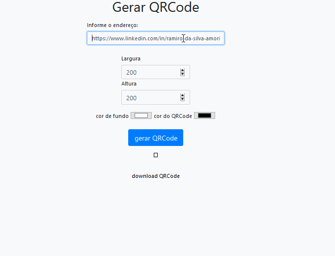

<h1 align="center">
    Gerar QRCode
</h1>

<h4 align="center"> 
	🚧 construção... 🚧
</h4>

  
  
  </a>

## 💻 Sobre o projeto

Gerar um QRCode de uma url.

## 🛠 Tecnologias

As seguintes ferramentas foram usadas na construção do projeto:

- [JavaScript][javascript]
- [Bootstrap][bootstrap]

## 📝 Licença

Este projeto esta sobe a licença MIT.

[Contato!](https://www.linkedin.com/in/ramiro-da-silva-amorim/)

[javascript]: https://developer.mozilla.org/pt-BR/docs/Web/JavaScript
[Bootstrap]: https://getbootstrap.com/
[license]: https://opensource.org/licenses/MIT